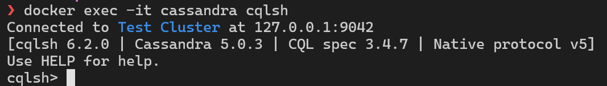

# A)
## Verbindung über cqlsh

# B)

## Q1

Bei diesem Screen ist es das Ziel alle Berufsbildner und ihre dazugehörigen Lernenden zu bekommen.
Die Partition Key gehört zu den Berufsbildnern, während man für den Cluster Key die Id der Lernenden benutzt.
Das ist der Code dazu:
```cql
CREATE TABLE lernende_by_berufsbildner (
	berufsbildner_id UUID,
	berufsbildner_name TEXT STATIC,
	lernender_id UUID,
	lernender_name TEXT,
	PRIMARY KEY (berufsbildner_id, lernender_id)
);
```
## Q2

Wenn man einen Lerhling ausgewählt hat kann man mit dieser Query seine Prüfungen und Noten darin sehen.
Als Partition Key benutze ich die ID des Lernenden und als Cluster Key die ID der Prüfungen.
```cql
CREATE TABLE pruefungen_by_lernender (
	lernender_id UUID,
	lernender_name TEXT STATIC,
	pruefung_id UUID,
	pruefung_name TEXT,
	pruefung_gewichtung FLOAT,
	pruefung_note FLOAT,
	PRIMARY KEY (lernender_id, pruefung_id)
);

```
## Q3

Diese Query ist unabhängig von den anderen. Damit sieht man alle Prüfungen, die zu einem Semester gehören.
Der Partition Key ist die ID des Semesters. Der Cluster Key ist die ID der Prüfung.
```cql
CREATE TABLE pruefungen_by_semester (
	semester_id UUID,
	pruefung_id UUID,
	pruefung_name TEXT,
	pruefung_date DATE,
	PRIMARY KEY (semester_id, pruefung_id)
);
```
