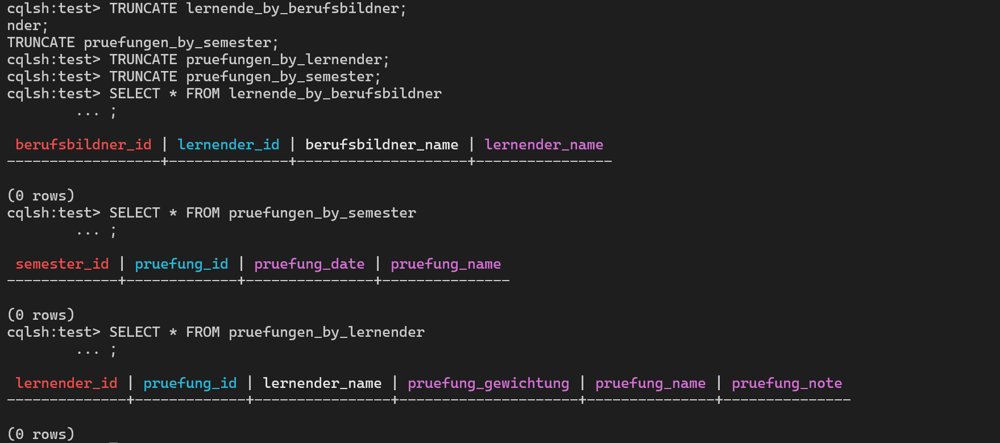
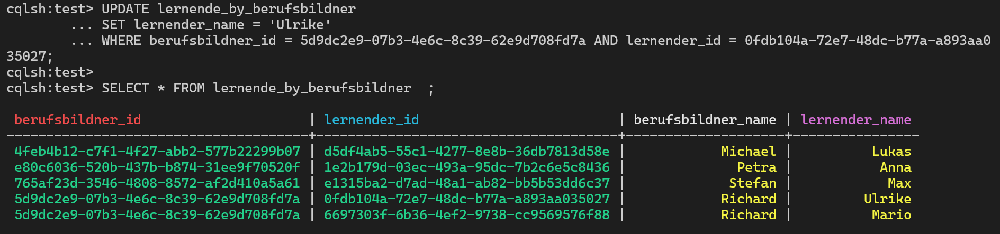
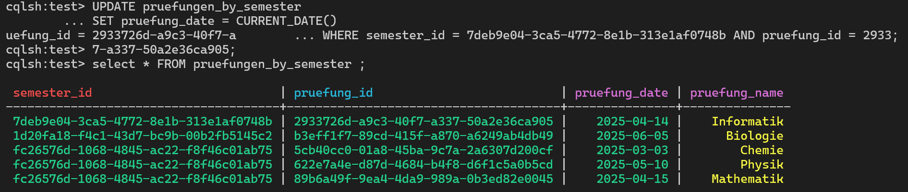
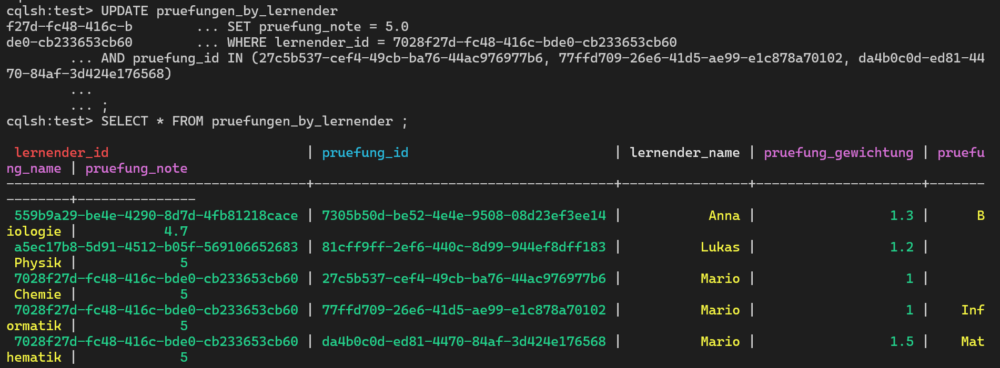

# A & B)

## [Insert Script](insert.cql)
## [Read Script](read.cql)

# C)
## Einzelne Spalte löschen in einer Zeile

## Alles bei einem Lernenden löschen

## [Delete Script](delete.cql)
## Clean

## [Clean Script](clean.cql)
# D)
Richards Lernende Sophie heisst ab jetzt Ulrike

Die Informatik Prüfung findet heute (14.04.2025) statt

Mario hat in allen Prüfungen genau eine 5.0

## [Update Script](update.cql)
