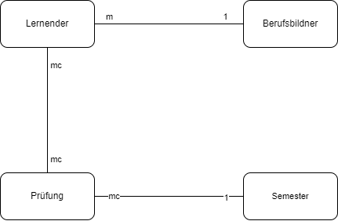

# A)
## Schema in Worten  
- Lernender
    - Ein Lernender hat n Prüfungen
    - Ein Lernender hat n Berufsbildner
- Berufsbildner
    - Ein Berufsbildner hat n Lernende
- Prüfung
    - Eine Prüfung hat
        - Note
        - Gewichtung
        - Name
        - Datum
- Note 
    - Eine Note gehört zu einer Prüfung
    - Eine Note gehört zu einem Lernenden
## Konzeptionelles Diagramm

[*.drawio Datei](./scheme_konzeptionell.drawio)
# B) Schema als Diagramm

[*.drawio Datei](./scheme.drawio)
> [!NOTE]
> Ich habe den Berufsbildner verschachtelt, da in meiner DB jeder Lernender nur einen Berufsbildner haben kann.
# C)
[Init-Script der DB und Collections](./init.js)
