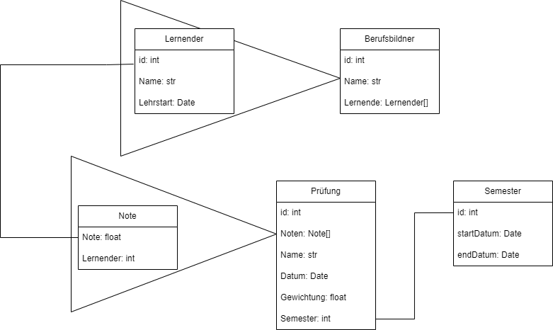

# A) Schema in Worten
- Lernender
    - Ein Lernender hat n Prüfungen
    - Ein Lernender hat n Berufsbildner
- Berufsbildner
    - Ein Berufsbildner hat n Lernende
- Prüfung
    - Eine Prüfung hat
        - Note
        - Gewichtung
        - Name
        - Datum
    - Eine Prüfung ist Teil von einem Semester
    - Eine Prüfung gehört zu einem Lernenden
- Semester
    - Ein Semester hat
        - StartDatum
        - EndDatum
# B) Schema als Diagramm

[*.drawio Datei](./scheme.drawio)
> [!NOTE]
> Ich habe mich für die Verschachtelung beim Semester entschieden, da das nur ein kleines Objekt ist,
> bei dem Redundanzen kein Problem sind
# C)
[Init-Script der DB und Collections](./init.js)
