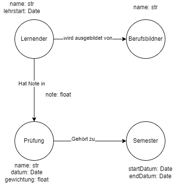

# A)
[Cloud init](./cloud-init.yml)

# B)
[draw.io datei](./graph.drawio)

## Erklärung
- Die Felder mit den IDs braucht es nicht mehr
- Statt eine einzelne Noten Tabelle zu haben, speichere ich die Note in der Verbindung
- Eine Prüfung ist mit einem Semester verbunden
- Ein Lernender ist mit seinem Berufsbildner verbunden
