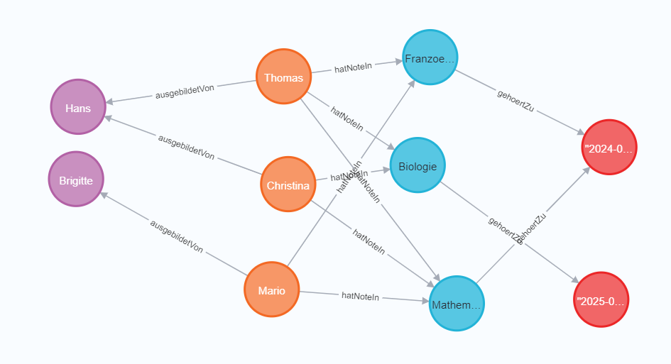
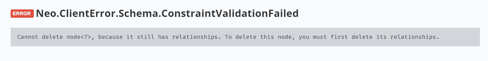
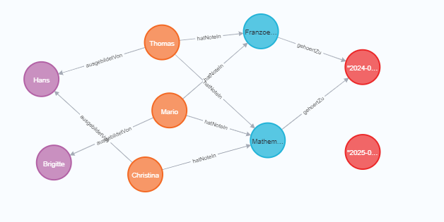

# B)
## Erklärung Read
```cypher
MATCH (n) OPTIONAL MATCH (n)-[r]->(m) RETURN n, r, m;
```
Nach dem Match in der Klammer kommt die Bedingung. 
Dort ist keine Bedingung, die Ausgabe wird in der Variable n gespeichert.
`(n)-[r]-(m)` sucht nach ausgehenden Verbindungen, wenn keine gefunden werden wird `n` trotzdem zurückgegeben,
wegen dem Optional.
## Weitere Reads
### Alle Noten aller Lernenden mit Lehrstart vor 2024 abfragen
```cypher
MATCH (n:Lernender WHERE n.lehrstart < date("2024-01-01"))-[r:hatNoteIn]->(m:Pruefung) RETURN n.name, r.note;
```
### Alle Lernenden eines Berufsbildners abfragen
```cypher
MATCH (n:Lernender)-[r:ausgebildetVon]->(m:Berufsbildner {name: "Brigitte"}) RETURN n, r, m;
```
### Alle Semester Anzeigen, in denen ein bestimmter Lernender Prüfungen geschrieben hat
```cypher
MATCH (:Lernender {name: "Mario"})-[:hatNoteIn]->(n:Pruefung) MATCH (n)-[:gehoertZu]->(m:Semester) RETURN m;
```
### Alle Noten abfragen, die höher als 5 sind
```cypher
MATCH (:Lernender)-[n:hatNoteIn WHERE n.note > 5.0]->(:Pruefung) RETURN n.note;
```
# C)
## Vorher

## Nachher ohne Detach
```Cypher
MATCH (n:Pruefung {name: "Biologie"}) DELETE n;
```

## Nachher mit Detach
```cypher
MATCH (n:Pruefung {name: "Biologie"}) DETACH DELETE n;
```

# D)
## Note von einem Lernenden in einer Prüfung ändern
```cypher
MATCH (n:Lernender {name: "Mario"})-[r:hatNoteIn]->(m:Pruefung {name: "Franzoesisch"}) SET r.note = 5.5 RETURN n, r, m
```
## Gewichtung von allen Prüfungen, die vor dem 06.13.2024 waren auf 3 setzen
```cypher
MATCH (n:Pruefung WHERE n.datum < date("2024-06-13")) SET n.gewichtung = 3.0 RETURN n;
```
## Namen von einem Berufsbildner eines bestimmten Lernenden ändern
```cypher
MATCH (:Lernender {name: "Thomas"})-[:ausgebildetVon]->(n:Berufsbildner) SET n.name = "Richard" RETURN n;
```
# E)
## Limit
```cypher
MATCH (:Lernender)-[n:hatNoteIn]->(:Pruefung) RETURN n.note LIMIT 2;
```
Limitiert die Anzahl der zurückgegebenen Zeilen.
In diesem Fall werden nicht mehr als 2 Zeilen zurückgegeben.
## Order by
```cypher
MATCH (:Lernender)-[n:hatNoteIn]->(:Pruefung) RETURN n.note ORDER BY n.note DESC;
```
Sortiert die zurückgegebenen Zeilen nach einer Spalte.
In diesem Fall werden sie absteigend nach Note sortiert.
