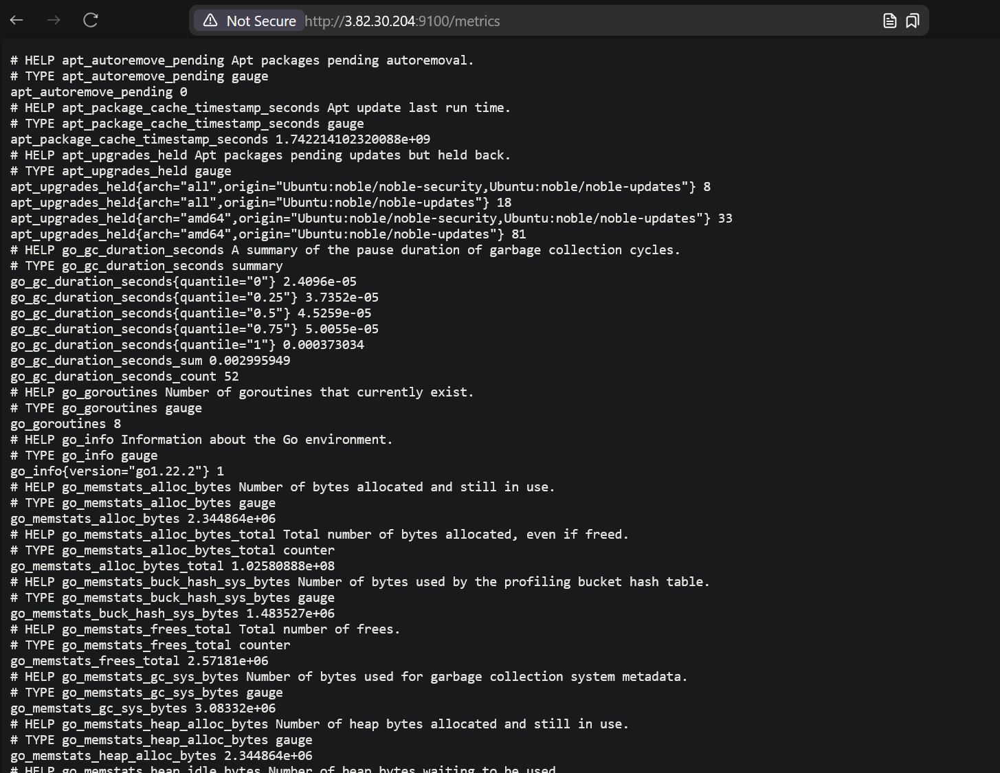

# A)
## Prometheus Node-Exporter Metrics

## Prometheus Dashboard

## Grafana Dashboard

## Grafana metrics

# B)
## Was sind Scrapes? Erklären Sie den Begriff im Zusammenhang mit Prometheus und geben Sie konkrete Beispiele
Scrapes sind die Requests, die Prometheus an das überwachte System sendet, um dessen Status zu überprüfen
Diese werden in meinem Beispiel alle 15s an `localhost:9090` und `localhost:9100` gesendet
## Was sind Rules? Erklären Sie den Begriff im Zusammenhang mit Prometheus und geben Sie konkrete Beispiele.
Es gibt alerting und recording rules:
### Recording rules
```yaml
- record: node_memory_MemFree_percent
    expr: 100 - (100 * node_memory_MemFree_bytes / node_memory_MemTotal_bytes)
```
Berechnen etwas bei der Abfrage, dass immer glech ist.
### Alerting rules
```yaml
rules:
    - alert: InstanceDown
    expr: up == 0
    for: 1m
    labels:
       serverity: critical
    annotations:
      summary: "Instance {{ $labels.instance }} down"
      description: "Instance {{ $labels.instance }} of job {{ $labels.job }} has been down for more than 1 minute."

``` 
Bestimmen, wann ein Alarm ausgelöst werden soll.
Beim Beispiel oben ist das, wenn die Instanz länger als eine Minute down war.
## Was sind die Schritte, die Sie als Programmierer ausführen müssen, um eigene Daten in Prometheus zu speichern?
1. Prometheus installieren
2. Konfigurieren damit etwas gescraped wird
3. Optional Metriken visualisieren
