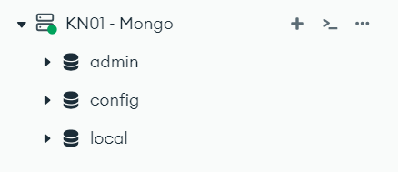
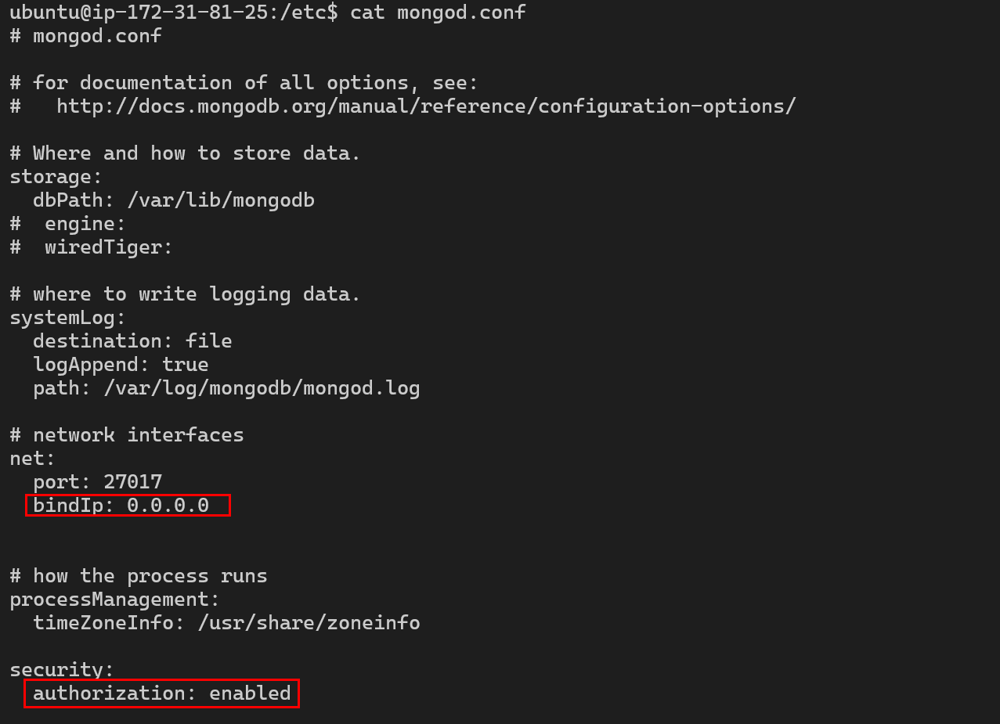
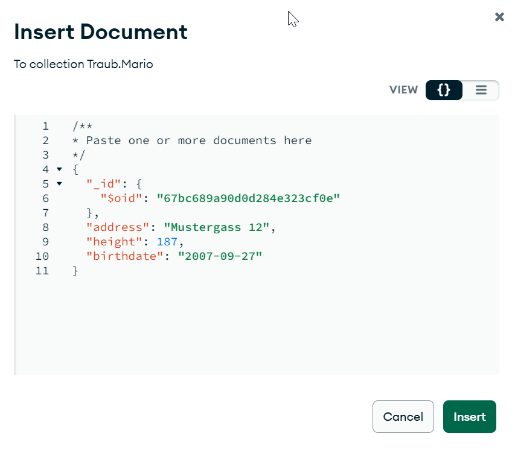
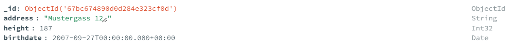
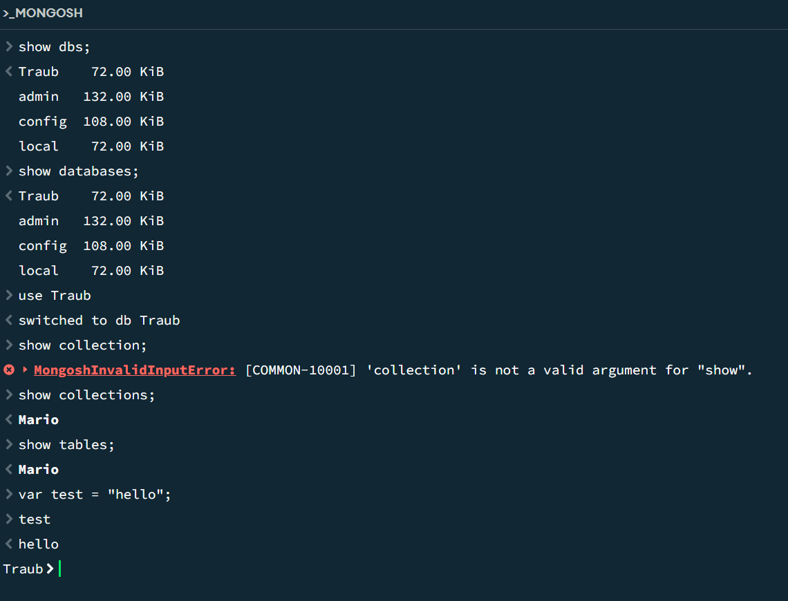
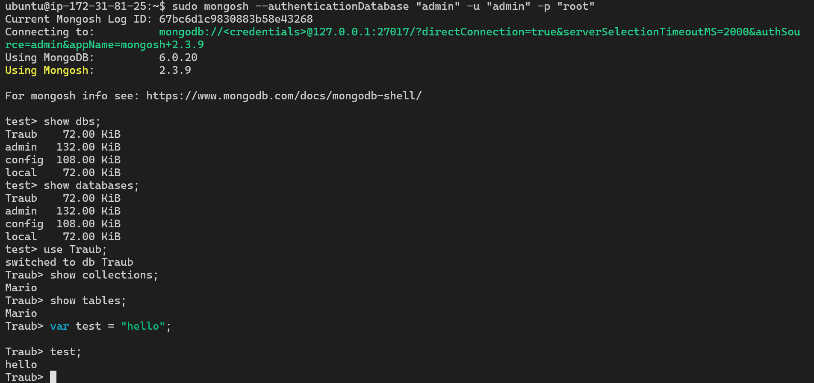

# A)
[Cloud-init](cloud-init.yml)

## Schauen Sie sich Ihren Connection String an. Erklären Sie was die Option authSource=admin macht
Admin ist der Name der DB in der die User Credentials gespeichert sind:
```json
        {
          user: "admin",
          pwd: "root",
          roles: [
            { role: "userAdminAnyDatabase", db: "admin" },
            { role: "readWriteAnyDatabase", db: "admin" }
          ]
        }

```
## Im cloud-init finden Sie zweimal den Linux Befehle sed
### Erklären Sie was die beiden Befehle bewirken
´´´bash
# Dieser Command legt fest von wo man auf die DB zugreifen kann
sudo sed -i 's/127.0.0.1/0.0.0.0/g' /etc/mongod.conf
# Dieser Command aktiviert die authorization
sudo sed -i 's/#security:/security:\n  authorization: enabled/g' /etc/mongod.conf
´´´

# B)

[JSON export](./Traub.Mario.json)
Indem eine solche Struktur benutz hätte: 
```json
Ich hätte vermutlich ein komplettes ISO-Date schreiben müssen, damit es als Datum gespeichert worden wäre.
```
## Aktualisiertes Schema

# C)



## Erklärung Commands
```bash
# Diese Befehle zeigen alle Datenbanken
show dbs;
show databases;
# Wechselt auf die Ausgewählte Datenbanken
use Ihre-Datenbank;
# Zeigt alle Collections in der Datenbank
show collections;
# tables ist einfach ein Alias für tables
show tables;
```
